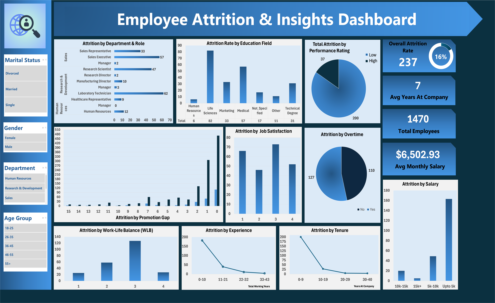

# Employee Attrition and Insights


### This project focuses on HR Analytics, aiming to uncover and analyze the main factors that drive employee attrition within an organization. The analysis is based on the IBM HR Analytics dataset, which includes information about employees’ demographics, job roles, performance ratings, satisfaction levels, and attrition status.

## 📊 Dataset Overview
The dataset includes various employee-related attributes such as:
- **Demographics**: Age, Gender, Marital_Status, Education_Field  
- **Job Details**: Department, Job_Role, Job_Level, Years_At_Company  
- **Performance & Compensation**: Monthly_Income, Performance_Rating, Over_Time  
- **Satisfaction Metrics**: Job_Satisfaction, Work_Life_Balance, Environment_Satisfaction

### 📊 Key Insights
```
Attrition Rate: 16%
Total Employees: 1470
Average Monthly Income: $6,502
Average Years at Company: 7
```

## Tools Used


- Excel Pivot Tables

- HR Analytics Dataset (IBM)